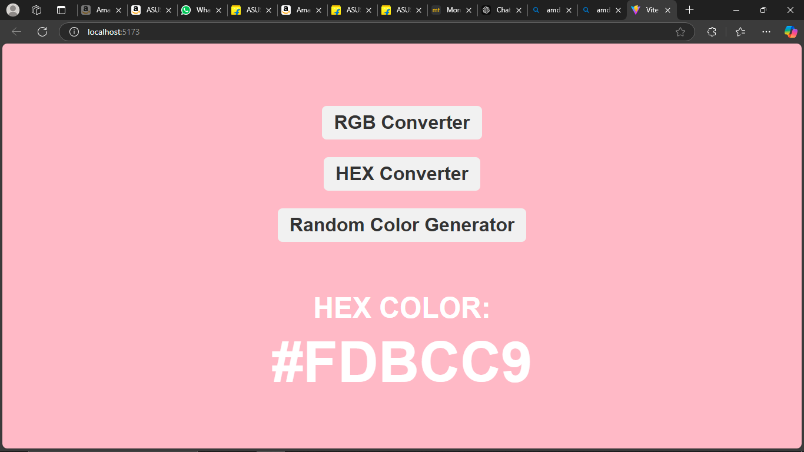
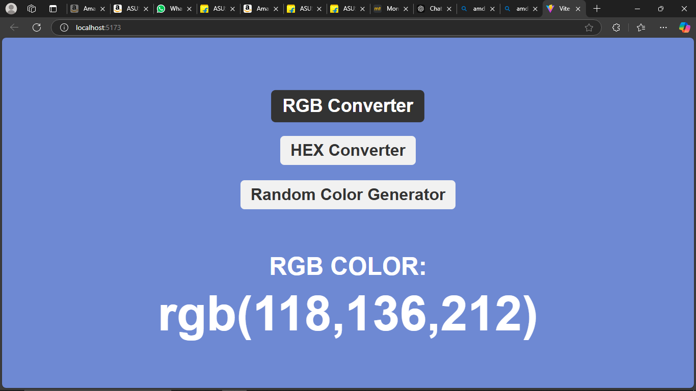
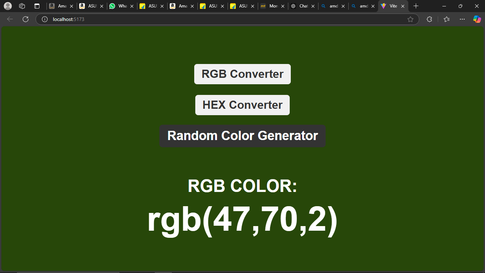

# Random Color Generator

This is a React-based project that generates random colors in two formats: Hexadecimal (HEX) and RGB. The user can toggle between the two formats and generate random colors accordingly. The generated color is displayed as the background color of the page.

---

## Features

- **HEX Color Generation**: Generates random colors in the Hexadecimal format (e.g., `#A1B2C3`).
- **RGB Color Generation**: Generates random colors in the RGB format (e.g., `rgb(123, 45, 67)`).
- **Dynamic Background**: Displays the generated color as the background of the page.
- **Interactive Buttons**: Toggle between HEX and RGB formats, or generate a new random color.

---

## Project Structure

```plaintext
src/
├── components/
│   ├── RandomColor.js    # Main component for the Random Color Generator
│   └── Random.css        # Stylesheet for the component
├── App.js                # Main application file
└── index.js              # Entry point of the React application

---

## Screenshots

### Default View


### RGB Format Color Example



### Random Color Example


---

## How to Use

1. Clone the repository:
   ```bash
   git clone  https://github.com/ExploreInsight/react-e.g-s.git

cd random-color-generator

2. Install Dependiecies 

npm install or npm i 

3.Start the App

npm start 
